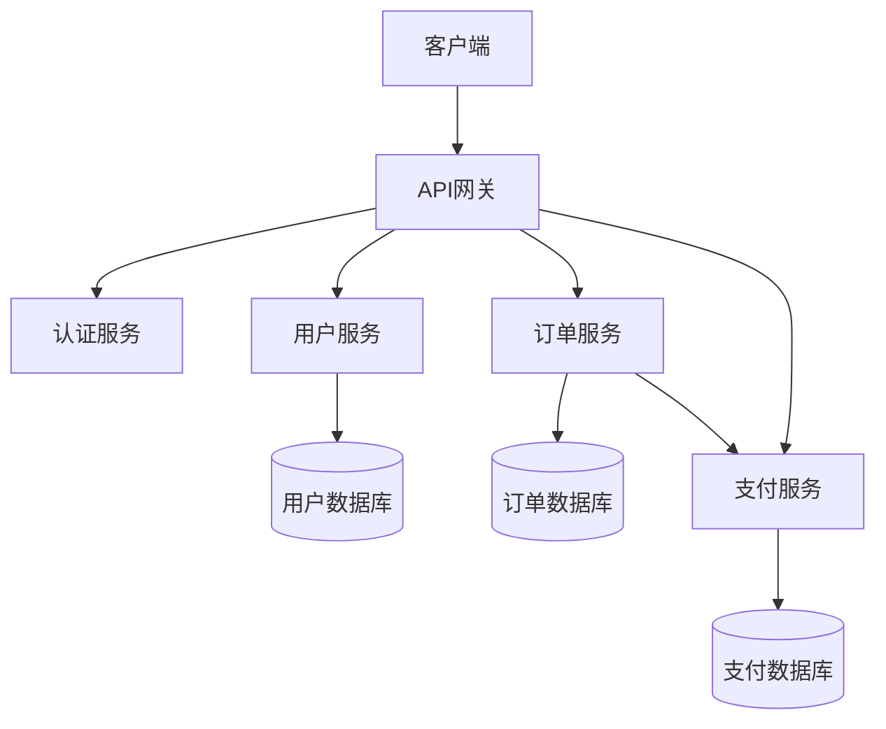
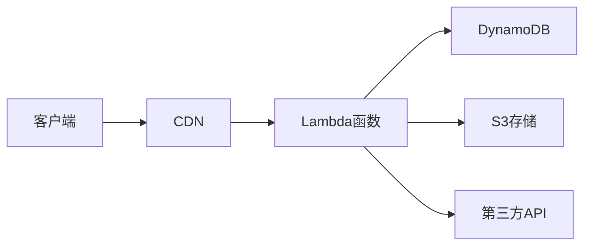

# AI辅助软件工程：开发流程与工具实践指南

> **文档编号**：AI-Tech-025  
> **撰写日期**：2026-03-30  
> **话题热度**：🔥🔥🔥🔥🔥（开发效率革命）  
> **目标读者**：开发者、架构师、AI工具使用者  
> **字数**：约10000字  
> **版本**：v1.0  
> **分类**：05-llm-applications

---

## 一、AI辅助软件工程概述

### 1.1 AI辅助开发的演进

软件开发行业正在经历前所未有的变革。从最初的代码编辑器，到IDE，再到如今的AI辅助编程工具，每个阶段都显著提升了开发效率。

**第一阶段：文本编辑器**
- 语法高亮、基础补全
- 效率提升：~20%

**第二阶段：IDE智能补全**
- 代码片段、模板生成
- 效率提升：~40%

**第三阶段：AI辅助编程**
- 上下文理解、代码生成、bug修复
- 效率提升：~200-500%

### 1.2 核心价值

AI辅助软件工程的核心价值体现在：

1. **代码生成**：根据描述或上下文自动生成代码
2. **Bug修复**：自动识别和修复常见错误
3. **代码重构**：优化代码结构和性能
4. **文档生成**：自动生成API文档和注释
5. **测试生成**：自动编写单元测试
6. **架构建议**：提供架构和设计模式建议

### 1.3 适用场景

| 场景 | AI辅助效果 | 推荐工具 |
|------|------------|----------|
| 重复性代码 | ⭐⭐⭐⭐⭐ | GitHub Copilot |
| Bug修复 | ⭐⭐⭐⭐ | Cursor |
| 新项目搭建 | ⭐⭐⭐⭐⭐ | OpenCode |
| 代码审查 | ⭐⭐⭐⭐ | Claude |
| 文档编写 | ⭐⭐⭐⭐⭐ | OpenClaw |
| 重构优化 | ⭐⭐⭐⭐ | BlackBox |

## 二、主流AI开发工具深度对比

### 2.1 GitHub Copilot

**概述**：GitHub与OpenAI合作推出的AI代码补全工具，是目前市场占有率最高的AI编程助手。

**核心特性**：
- 实时代码补全
- 多语言支持（70+语言）
- 代码解释功能
- 单元测试生成
- CLI命令推荐

**架构原理**：
```
用户输入 → Context收集 → LLM推理 → 候选代码 → 排序筛选 → 输出
    ↓
[当前文件] [相邻文件] [项目配置] [语言规范]
```

**使用技巧**：
```python
# 1. 注释触发：写出功能描述，AI生成代码
def calculate_fibonacci(n):
    """Calculate the nth Fibonacci number using iteration"""
    # AI会生成：
    if n <= 1:
        return n
    a, b = 0, 1
    for _ in range(n - 1):
        a, b = b, a + b
    return b

# 2. Ctrl+Enter：手动触发建议
# 3. Tab键：接受建议
# 4. Alt+] / Alt+[：切换建议
```

**价格**：
- 免费版：基本代码补全
- Copilot Pro：$10/月，个人使用
- Copilot Business：$19/月/用户，企业版

### 2.2 Cursor

**概述**：基于VS Code的AI-first编辑器，专为AI协作编程设计。

**核心特性**：
- 对话式编程
- 项目级上下文理解
- 智能编辑（Edit）
- 增量生成（Generate）
- 代码库感知

**核心命令**：
```
Ctrl+K：打开AI编辑面板
Ctrl+L：打开对话面板
Ctrl+Enter：生成整个文件
```

**项目感知示例**：
```python
# 在项目中询问：
# "Where is the authentication logic?"

# Cursor会分析：
# - 扫描所有文件
# - 查找auth相关代码
# - 返回文件路径和说明
# src/auth/login.py (line 45)
# src/middleware/auth.py (line 12)
# src/utils/jwt.py (line 8)
```

**价格**：
- 免费版：免费但有使用限制
- Pro：$20/月，无限制使用
- Business：$40/月/用户

### 2.3 OpenCode

**概述**：国产AI编程助手，提供代码生成、理解和优化能力。

**核心特性**：
- 中文优化
- 代码补全与生成
- 项目理解
- 函数生成
- 代码解释

**使用场景**：
```python
# 代码生成
# 输入：创建一个用户注册函数，包含邮箱验证和密码加密
# 输出：
import hashlib
import re

def validate_email(email: str) -> bool:
    pattern = r'^[a-zA-Z0-9._%+-]+@[a-zA-Z0-9.-]+\.[a-zA-Z]{2,}$'
    return re.match(pattern, email) is not None

def hash_password(password: str) -> str:
    return hashlib.sha256(password.encode()).hexdigest()

def register_user(username: str, email: str, password: str) -> dict:
    if not validate_email(email):
        return {"success": False, "error": "Invalid email format"}
    
    if len(password) < 8:
        return {"success": False, "error": "Password too short"}
    
    hashed = hash_password(password)
    # 保存到数据库...
    return {"success": True, "user": {"username": username, "email": email}}
```

**价格**：免费使用

### 2.4 OpenClaw

**概述**：全能AI助手，支持编程、自动化、文件操作等。

**核心特性**：
- 多工具集成
- 文件系统操作
- Shell命令执行
- 浏览器控制
- 定时任务

**架构设计**：
```
OpenClaw架构：

┌──────────────────────────────────────────┐
│              用户交互层                  │
│  (QQ/Telegram/Discord/WebChat)          │
└────────────────────┬─────────────────────┘
                     │
┌────────────────────▼─────────────────────┐
│              核心引擎                     │
│  ┌─────────┐ ┌─────────┐ ┌─────────┐    │
│  │推理引擎 │ │工具引擎 │ │记忆引擎 │    │
│  └─────────┘ └─────────┘ └─────────┘    │
└────────────────────┬─────────────────────┘
                     │
┌────────────────────▼─────────────────────┐
│              工具层                       │
│  代码 │ 文件 │ 搜索 │ 浏览器 │ 消息     │
└──────────────────────────────────────────┘
```

**编程工作流**：
```python
# 1. 需求分析
# 用户：帮我创建一个简单的REST API

# 2. OpenClaw分析与生成
# - 创建项目结构
# - 编写路由代码
# - 添加数据库模型
# - 生成测试用例

# 3. 交付产物
# 项目/
# ├── app.py
# ├── models.py
# ├── routes.py
# └── test_app.py
```

### 2.5 工具对比矩阵

| 特性 | GitHub Copilot | Cursor | OpenCode | OpenClaw |
|------|----------------|--------|----------|----------|
| 代码补全 | ✅ | ✅ | ✅ | ✅ |
| 对话式编程 | ❌ | ✅ | ✅ | ✅ |
| 文件操作 | ❌ | ❌ | ❌ | ✅ |
| Shell执行 | ❌ | ❌ | ❌ | ✅ |
| 浏览器控制 | ❌ | ❌ | ❌ | ✅ |
| 中文优化 | 一般 | 一般 | ✅ | ✅ |
| 免费使用 | ❌ | 有限 | ✅ | ✅ |
| 插件生态 | 多 | 少 | 少 | 发展中 |

## 三、AI辅助开发工作流

### 3.1 需求到代码工作流

```python
"""
AI辅助开发标准工作流：

Phase 1: 需求理解
  ↓
  AI分析需求文档
  提取关键功能和约束
  生成技术规格说明

Phase 2: 架构设计
  ↓
  AI推荐技术栈
  设计系统架构
  生成UML图表

Phase 3: 代码生成
  ↓
  文件结构创建
  核心代码实现
  单元测试编写

Phase 4: 审查优化
  ↓
  代码审查建议
  性能优化提示
  安全检查

Phase 5: 部署运维
  ↓
  Docker配置
  CI/CD配置
  监控告警设置
"""

class AIDevelopmentWorkflow:
    def __init__(self, ai_assistant):
        self.ai = ai_assistant
    
    def execute(self, requirements: str) -> dict:
        """执行完整工作流"""
        
        # Phase 1: 需求理解
        specs = self.understand_requirements(requirements)
        
        # Phase 2: 架构设计
        architecture = self.design_architecture(specs)
        
        # Phase 3: 代码生成
        code = self.generate_code(architecture)
        
        # Phase 4: 审查优化
        review = self.review_code(code)
        
        # Phase 5: 部署配置
        deploy = self.prepare_deployment(code)
        
        return {
            "specifications": specs,
            "architecture": architecture,
            "code": code,
            "review": review,
            "deployment": deploy
        }
    
    def understand_requirements(self, requirements: str) -> dict:
        """理解需求"""
        prompt = f"""分析以下需求，生成技术规格：

需求：{requirements}

请输出JSON格式：
{{
    "功能列表": [],
    "技术约束": [],
    "性能要求": {},
    "安全要求": []
}}
"""
        return self.ai.generate(prompt)
```

### 3.2 项目初始化工作流

```python
class ProjectInitializer:
    def __init__(self, ai_assistant):
        self.ai = ai_assistant
    
    def init_python_project(self, project_name: str, features: list) -> None:
        """初始化Python项目"""
        
        # 1. 创建项目结构
        structure = {
            f"{project_name}/": ["__init__.py"],
            f"{project_name}/core/": ["__init__.py", "main.py"],
            f"{project_name}/models/": ["__init__.py", "schemas.py"],
            f"{project_name}/api/": ["__init__.py", "routes.py"],
            f"{project_name}/utils/": ["__init__.py", "helpers.py"],
            "tests/": ["__init__.py", "test_main.py"],
            "docs/": [],
            "requirements.txt": None,
            "README.md": None,
            ".gitignore": None
        }
        
        # 2. 生成核心文件
        for file_path, template in structure.items():
            if template is None:
                continue
            
            content = self._generate_file_content(file_path, features)
            self._write_file(file_path, content)
        
        print(f"✅ 项目 {project_name} 初始化完成")
    
    def _generate_file_content(self, file_path: str, features: list) -> str:
        """生成文件内容"""
        
        prompts = {
            "requirements.txt": f"生成Python项目requirements.txt，需要：{', '.join(features)}",
            "README.md": f"生成项目README，项目名称：{file_path.split('/')[0]}",
            "__init__.py": "生成Python包__init__.py"
        }
        
        prompt = prompts.get(file_path.split("/")[-1], "生成标准Python代码")
        return self.ai.generate(prompt)
```

### 3.3 Bug修复工作流

```python
class AIBugFixer:
    def __init__(self, ai_assistant):
        self.ai = ai_assistant
    
    def fix_bug(self, error_message: str, code_snippet: str, stack_trace: str) -> dict:
        """AI辅助Bug修复"""
        
        # 1. 分析错误
        analysis = self._analyze_error(error_message, stack_trace)
        
        # 2. 定位问题
        location = self._locate_problem(analysis, code_snippet)
        
        # 3. 生成修复方案
        fix = self._generate_fix(location, code_snippet)
        
        # 4. 验证修复
        verified = self._verify_fix(fix, error_message)
        
        return {
            "analysis": analysis,
            "location": location,
            "fix": fix,
            "verified": verified
        }
    
    def _analyze_error(self, error_message: str, stack_trace: str) -> dict:
        """分析错误"""
        prompt = f"""分析以下错误：

错误信息：{error_message}

堆栈跟踪：
{stack_trace}

请输出JSON：
{{
    "错误类型": "",
    "根本原因": "",
    "影响范围": "",
    "修复优先级": ""
}}
"""
        response = self.ai.generate(prompt)
        
        try:
            return json.loads(response)
        except:
            return {"错误类型": "未知", "根本原因": response}
```

### 3.4 代码审查工作流

```python
class AICodeReviewer:
    def __init__(self, ai_assistant):
        self.ai = ai_assistant
    
    def review_code(self, code: str, language: str, context: str = "") -> dict:
        """代码审查"""
        
        prompt = f"""请审查以下{language}代码：

代码：
```{language}
{code}
```

上下文：{context}

请从以下维度审查：
1. 代码正确性
2. 性能问题
3. 安全漏洞
4. 代码规范
5. 可维护性

请输出JSON格式的审查报告：
{{
    "问题列表": [
        {{"严重度": "高/中/低", "位置": "", "问题": "", "建议": ""}}
    ],
    "评分": {{"正确性": 0-10, "性能": 0-10, "安全": 0-10, "规范": 0-10}},
    "总体评价": ""
}}
"""
        response = self.ai.generate(prompt)
        
        try:
            return json.loads(response)
        except:
            return {"问题列表": [], "评分": {}, "总体评价": response}
```

## 四、OpenClaw编程实践

### 4.1 OpenClaw编程基础

**文件操作**：
```python
# 1. 读取文件
content = read("project/main.py")

# 2. 写入文件
write("project/utils/helper.py", """def helper():
    return "Hello"
""")

# 3. 编辑文件（精确修改）
edit("project/main.py", 
     oldText="def old_function():",
     newText="def new_function():")
```

**Shell命令执行**：
```python
# 执行Shell命令
result = exec("python -m venv venv")
result = exec("pip install -r requirements.txt")
result = exec("pytest tests/ -v")
```

**浏览器控制**：
```python
# 打开网页
browser(action="open", url="https://github.com")

# 截图
browser(action="screenshot")

# 点击元素
browser(action="act", kind="click", ref="login-btn")
```

### 4.2 自动化脚本生成

```python
"""
OpenClaw自动化脚本案例：

场景：自动备份项目文件并推送到GitHub

步骤：
1. 打包项目文件
2. 添加时间戳
3. Git提交
4. 推送到远程
"""

# 自动化脚本
BACKUP_SCRIPT = '''
import os
import shutil
from datetime import datetime

def backup_project(project_path, backup_dir):
    # 创建带时间戳的备份名
    timestamp = datetime.now().strftime("%Y%m%d_%H%M%S")
    backup_name = f"backup_{timestamp}"
    
    # 复制项目
    shutil.copytree(project_path, f"{backup_dir}/{backup_name}")
    
    print(f"✅ 备份完成: {backup_name}")
    return backup_name

if __name__ == "__main__":
    backup_project("./myproject", "./backups")
'''

# OpenClaw执行
write("scripts/backup.py", BACKUP_SCRIPT)
exec("python scripts/backup.py")
```

### 4.3 Web开发自动化

```python
"""
使用OpenClaw快速搭建Web项目

场景：创建Flask REST API
"""

# 1. 创建项目结构
exec("mkdir -p flask_api/{models,routes,utils,tests}")

# 2. 生成主应用
write("flask_api/app.py", '''from flask import Flask, jsonify
from flask_api.routes import api_bp

app = Flask(__name__)
app.register_blueprint(api_bp, url_prefix="/api")

@app.route("/")
def index():
    return jsonify({"message": "API is running"})

if __name__ == "__main__":
    app.run(debug=True)
''')

# 3. 生成路由
write("flask_api/routes/__init__.py", '''from flask import Blueprint, jsonify

api_bp = Blueprint("api", __name__)

@api_bp.route("/users", methods=["GET"])
def get_users():
    return jsonify({"users": []})

@api_bp.route("/users", methods=["POST"])
def create_user():
    return jsonify({"message": "User created"}), 201
''')

# 4. 运行测试
exec("cd flask_api && python -m pytest tests/ -v")
```

### 4.4 数据处理自动化

```python
"""
使用OpenClaw进行数据处理

场景：批量处理CSV文件
"""

# 数据处理脚本
DATA_PROCESS_SCRIPT = '''
import pandas as pd
import os

def process_csv_files(input_dir, output_dir):
    os.makedirs(output_dir, exist_ok=True)
    
    for filename in os.listdir(input_dir):
        if filename.endswith(".csv"):
            df = pd.read_csv(f"{input_dir}/{filename}")
            
            # 数据清洗
            df = df.dropna()
            df = df.drop_duplicates()
            
            # 添加处理时间戳
            df["processed_at"] = pd.Timestamp.now()
            
            # 保存
            output_path = f"{output_dir}/{filename}"
            df.to_csv(output_path, index=False)
            
            print(f"✅ 处理完成: {filename}")

if __name__ == "__main__":
    process_csv_files("./data/raw", "./data/processed")
'''

write("scripts/data_processor.py", DATA_PROCESS_SCRIPT)
exec("python scripts/data_processor.py")
```

## 五、AI辅助架构设计

### 5.1 系统架构生成

```python
class AIArchitect:
    def __init__(self, ai_assistant):
        self.ai = ai_assistant
    
    def generate_architecture(self, requirements: dict) -> dict:
        """生成系统架构"""
        
        prompt = f"""根据以下需求设计系统架构：

需求：
- 项目类型：{requirements.get('type')}
- 规模：{requirements.get('scale')}
- 用户量：{requirements.get('users')}
- 功能：{', '.join(requirements.get('features', []))}

请设计：
1. 技术栈选择
2. 系统架构图（Mermaid格式）
3. 核心组件说明
4. 数据模型设计
"""
        
        return self.ai.generate(prompt)
    
    def generate_mermaid(self, architecture_type: str) -> str:
        """生成Mermaid架构图"""
        
        templates = {
            "microservices": """

""",
            "serverless": """

"""
        }
        
        return templates.get(architecture_type, "")
```

### 5.2 数据库设计

```python
class AIDatabaseDesigner:
    def __init__(self, ai_assistant):
        self.ai = ai_assistant
    
    def design_schema(self, entities: list, relationships: list) -> dict:
        """设计数据库Schema"""
        
        prompt = f"""设计数据库Schema：

实体：{', '.join(entities)}
关系：{', '.join(relationships)}

请生成：
1. 表结构（SQL）
2. 索引设计
3. 外键关系
"""
        
        sql = self.ai.generate(prompt)
        
        return {
            "sql": sql,
            "tables": self._extract_tables(sql),
            "indexes": self._extract_indexes(sql)
        }
```

### 5.3 API设计

```python
class AIAPIDesigner:
    def __init__(self, ai_assistant):
        self.ai = ai_assistant
    
    def design_api(self, endpoints: list) -> dict:
        """设计REST API"""
        
        prompt = f"""设计REST API：

端点：{', '.join(endpoints)}

请生成OpenAPI规范（YAML格式）：
"""
        
        openapi = self.ai.generate(prompt)
        
        return {
            "openapi": openapi,
            "endpoints": self._parse_endpoints(openapi)
        }
```

## 六、质量保证与测试

### 6.1 单元测试生成

```python
class AITestGenerator:
    def __init__(self, ai_assistant):
        self.ai = ai_assistant
    
    def generate_tests(self, code_file: str, test_framework: str = "pytest") -> str:
        """生成单元测试"""
        
        code = read(code_file)
        
        framework_templates = {
            "pytest": f"""import pytest
from {code_file.replace('.py', '')} import *

# 测试代码
{code}
""",
            "unittest": f"""import unittest
from {code_file.replace('.py', '')} import *

class TestClass(unittest.TestCase):
    pass
"""
        }
        
        prompt = f"""为以下代码生成{test_framework}测试：

```python
{code}
```
"""
        
        return self.ai.generate(prompt)
```

### 6.2 集成测试生成

```python
class AIIntegrationTester:
    def __init__(self, ai_assistant):
        self.ai = ai_assistant
    
    def generate_integration_tests(self, api_spec: dict) -> str:
        """生成集成测试"""
        
        prompt = f"""生成集成测试：

API规格：
{json.dumps(api_spec)}

请生成pytest测试代码，包含：
- API端点测试
- 错误处理测试
- 认证测试
"""
        
        return self.ai.generate(prompt)
```

### 6.3 性能测试

```python
class AIPerformanceTester:
    def __init__(self, ai_assistant):
        self.ai = ai_assistant
    
    def generate_load_test(self, endpoint: str, config: dict) -> str:
        """生成负载测试"""
        
        prompt = f"""使用locust生成负载测试：

目标：{endpoint}
并发：{config.get('users', 100)}
持续时间：{config.get('duration', '5m')}

请生成locust测试代码：
"""
        
        return self.ai.generate(prompt)
```

## 七、DevOps自动化

### 7.1 CI/CD配置

```python
class AICICDGenerator:
    def __init__(self, ai_assistant):
        self.ai = ai_assistant
    
    def generate_github_actions(self, project_type: str) -> str:
        """生成GitHub Actions配置"""
        
        prompt = f"""生成GitHub Actions CI/CD配置：

项目类型：{project_type}
要求：
- 代码检查
- 单元测试
- 构建
- 部署
"""
        
        return self.ai.generate(prompt)
    
    def generate_dockerfile(self, language: str, framework: str) -> str:
        """生成Dockerfile"""
        
        prompt = f"""生成{language} + {framework}的Dockerfile：
"""
        
        return self.ai.generate(prompt)
```

### 7.2 监控配置

```python
class AIMonitoringGenerator:
    def __init__(self, ai_assistant):
        self.ai = ai_assistant
    
    def generate_prometheus_config(self, app_name: str) -> str:
        """生成Prometheus配置"""
        
        prompt = f"""生成Prometheus监控配置：

应用名称：{app_name}

需要监控：
- 容器资源使用
- 应用性能指标
- 错误率
"""
        
        return self.ai.generate(prompt)
```

## 八、最佳实践

### 8.1 提示词工程

**DO**：
- 提供清晰的上下文
- 说明代码用途和约束
- 使用具体示例
- 指定输出格式

**DON'T**：
- 模糊的需求描述
- 忽略错误处理
- 不考虑安全因素
- 假设AI知道全部上下文

### 8.2 代码审查要点

1. **AI生成代码需人工审查**
2. **关注边界条件**
3. **验证安全漏洞**
4. **检查性能影响**

### 8.3 工具选择建议

| 场景 | 推荐工具 |
|------|----------|
| 快速原型 | OpenClaw |
| 代码补全 | GitHub Copilot |
| 复杂重构 | Cursor |
| 中文项目 | OpenCode |
| 全栈开发 | OpenClaw + Copilot |

### 8.4 学习路径

```
AI辅助开发学习路径：

Week 1: 基础入门
├── 掌握Copilot基础使用
├── 学习基本提示词技巧
└── 完成简单代码生成

Week 2: 进阶应用
├── 掌握Cursor高级功能
├── 学习代码重构提示
└── 实践Bug修复

Week 3: 集成实践
├── 集成OpenClaw到工作流
├── 自动化测试生成
└── CI/CD配置

Week 4: 高级优化
├── 架构设计辅助
├── 性能优化提示
└── 安全审查实践
```

---

**更新日志**：
- 2026-03-30: 初始版本创建（v1.0）